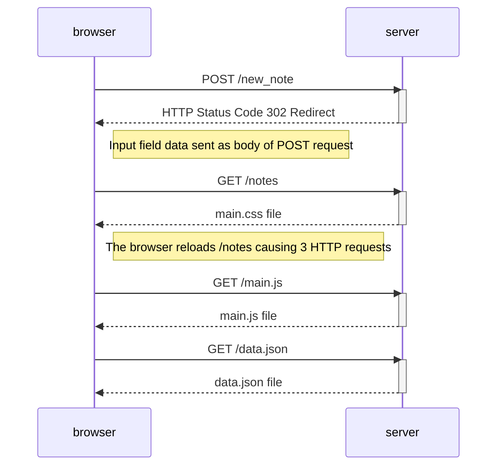

```mermaid
sequenceDiagram
    participant browser
    participant server

    browser->>server: POST /new_note
    activate server
    server-->>browser: HTTP Status Code 302 Redirect
    deactivate server
    
	Note right of browser: Input field data sent as body of POST request

    browser->>server: GET /notes
    activate server
    server-->>browser: main.css file
    deactivate server

	Note right of browser: The browser reloads /notes causing 3 HTTP requests

    browser->>server: GET /main.js
    activate server
    server-->>browser: main.js file
    deactivate server

    browser->>server: GET /data.json
    activate server
    server-->>browser: data.json file
    deactivate server
```